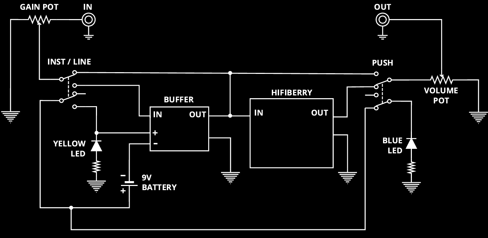

# AmpEmulatorPlugin
Este proyecto académico, [1], contiene la implementación de una aplicación *standalone* y plugin VST3 que emplea inteligencia artificial, para emular en tiempo real amplificadores y pedales de guitarra eléctrica (*overdrive*, distorsión y compresión). Implementado mediante el *framework* JUCE, empleando el modelo WaveNet de C++ llamado [WaveNetVA](https://github.com/damskaggep/WaveNetVA). Basado en los trabajos [2,3,6]. 

#### Créditos
Desarrollado originalmente como parte de mi [Trabajo Fin de Grado](https://zenodo.org/records/15490785) para la titulación de Ingeniería Informática de la Universidad de La Rioja (España), titulado *Aprendizaje profundo para la emulación en tiempo real de equipamiento de guitarra eléctrica con Raspberry Pi 5*. Basado conceptualmente en los repositorios [WaveNetVA](https://github.com/damskaggep/WaveNetVA) de Damskägg, Eero-Pekka y [SmartGuitarAmp](https://github.com/GuitarML/SmartGuitarAmp), de Keith Bloemer [4]. Hardware complementario desarrollado como plataforma de despliegue basado en [Proteus](https://www.youtube.com/watch?v=dFMsWW0uC7w), de Keith Bloemer, [7]. Agradezco mucho sus contribuciones a la comunidad, gracias a las cuales no solo he aprendido mucho, sino que he podido testear mi proyecto empleando sus plugins [5].

## Funcionamiento
La aplicación cuenta con dos versiones para Windows/x86.
- Versión *standalone* o de escritorio compatible con las interfaces de audio [Focusrite Scarlett SOLO 3rd Gen](https://shop.plastic.es/estudio/interfaces-de-audio/focusrite-interfaces-de-audio/focusrite-scarlett-solo-3rd-gen/). 
- Versión plugin VST3 compatible con cualquier DAW (*Digital Audio Workstation*). Testeada correctamente sobre [Reaper](https://www.reaper.fm/).   

La versión *standalone* para Linux/aarch64 pronto tendrá una *release*.
<p float="left">
  
   
</p>

> (Izq.) Interfaz de usuario de la aplicación *standalone*   
> (Der.) Plugin VST3 embebido desde Reaper

## Compilación
El repositorio contiene el código de un proyecto del *framework* [JUCE](https://juce.com/), concretamente de la versión 5.4.2. Se trata de una versión actualmente obsoleta y que no se puede descargar desde los repositorios oficiales, porque fue eliminada, aunque todavía existen *forks* no oficiales. El proyecto tuvo que ser compilado con esta versión debido a las dependencias introducidas por [WaveNetVA](https://github.com/damskaggep/WaveNetVA). **No recomiendo compilarlo manualmente, en nuestro caso fue muy complicado configurar el entorno de desarrollo correctamente**. En caso de querer hacerlo igualmente, a continuación damos algunos *tips* para ello.

> Una vez obtenido JUCE 5.4.2 hay que compilarlo también. Este *framework* se acopla a Visual Studio, desde el cual puede lanzarse y compilar el proyecto. La versión de `gcc` necesaria para compilar todo debe ser necesariamente < 9.
> El proyecto depende de dos librerías externas: [Eigen](https://eigen.tuxfamily.org/index.php?title=Main_Page) y el [SDK de ASIO de Steinberg](https://www.steinberg.net/es/developers/), en las versiones 3.3.7 y 2.3.3 respectivamente. Para que JUCE las detecte, debe crearse una carpeta `./Libraries`.
> Es probable que muchas dependencias estén rotas, debido a la recién instalada versión de JUCE, en cuyo caso no queda otra que arreglarlas manualmente desde JUCE.

#### Windows/x86
Una vez instalado JUCE, abrir el proyecto mediante el fichero `AmpEmulatorPlugin.jucer` y lanzarlo con Visual Studio. Desde el IDE, es tan sencillo como compilar en versión *release* (en caso contrario, no se aplicarán las optimizaciones necesarias y no funcionará en tiempo real). 

#### Linux/aarch64
Crear el MakeFile mediante JUCE. Instalar las siguientes dependencias:
```bash
sudo apt-get install libtiff-dev
sudo apt-get libwebkit2gtk-4.0-dev
```
Ir a la carpeta recién creada `./Builds/LinuxMakefile` y hacer `make`. Es necesario modificar el linkado de las dependencias desde el `Makefile` y poner `make config = Release`.

## Despliegue sobre Raspberry Pi 5
La aplicación *standalone* para Linux/aarch64 se ha probado que funciona en tiempo real sobre [Raspberry Pi 5](https://www.raspberrypi.com/products/raspberry-pi-5/), con el sistema operativo por defecto, Raspberry OS. En el proyecto del que forma parte este repositorio, [1], se construye un pedal digital completamente funcional y se da un listado de los materiales y del circuito empleados. Mediante esta aplicación u otras, como [6,7], se puede construir fácilmente un pedal o amplificador casero totalmente operativo y con sonido de alta fidelidad. La idea del pedal está basada en el pedal [Proteus](https://www.youtube.com/watch?v=dFMsWW0uC7w), de Keith Bloemer, [7].
<p float="left">
  
   
</p>

## Referencias
[1] Jiménez Santana, J.: "Aprendizaje profundo para la emulación en tiempo real de equipamiento de guitarra eléctrica con Raspberry Pi 5". *Zenodo* (2025). [DOI](https://doi.org/10.5281/zenodo.15490785)   
[2]	Wright, A. et al.: "Real-Time Guitar Amplifier Emulation with Deep Learning". *Applied Sciences* (2020). [DOI](https://doi.org/10.3390/app10030766)   
[3]	Van den Oord, A. et al.: "WaveNet: A Generative Model for Raw Audio". *arXiv* (2016). [DOI](https://doi.org/10.48550/arXiv.1609.03499)   
[4]	Bloemer, K.: PedalNetRT, [GitHub](https://github.com/GuitarML/PedalNetRT). (2020).   
[5]	Damskägg, E.-P.: WaveNetVA, [GitHub](https://github.com/damskaggep/WaveNetVA). (2019).   
[6]	Bloemer, K.: SmartPluginAmp, [GitHub](https://github.com/GuitarML/SmartGuitarAmp). (2020).
[7] Bloemer, K.: Proteus, [GitHub](https://github.com/GuitarML/Proteus). (2023).

Autor: *Javier Jiménez Santana*   
Tutores: *Jose Divasón Mallagaray, Silvano Nájera Canal*
